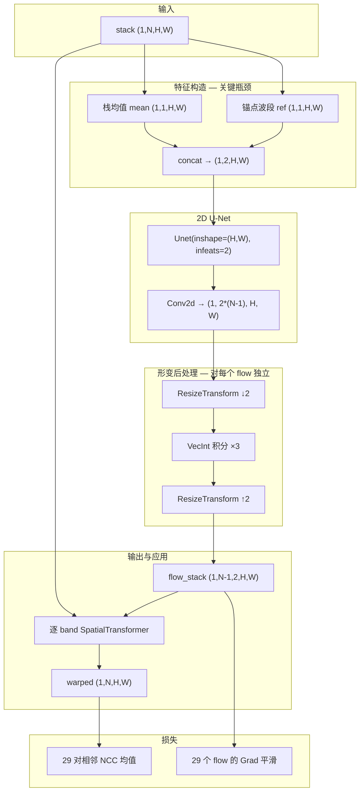

# PIFReg StackFlow 网络架构解读

> 对应代码：`src/python/registration/pif_groupwise_stackflow.py`  
> 实验入口：`src/python/experiments/run_pifreg_groupwise_stackflow_exp.py`  
> Backbone 来源：`src/python/voxelmorph/networks.py`（官方 VoxelMorph 2D U-Net）

---

## 1. 你在优化什么？

StackFlow 把 **N 个波段** 当作一个「数据栈」，但**不是**把 `(N, H, W)` 当作 3D 体输入网络。

| 概念 | 形状 | 说明 |
|------|------|------|
| 输入栈 `stack` | `(1, N, H, W)` | 例如 30×256×256 |
| 输出位移场栈 `flow_stack` | `(1, N-1, 2, H, W)` | 锚点波段（默认 band 0）无位移；其余各一个 **2D** 位移场 |
| 配准后栈 | `(1, N, H, W)` | 各波段用**各自的** 2D flow warp，再算损失 |

**一次前向 = 联合预测 29 张 2D 位移场**（30 波段时），再通过相邻波段 NCC 均值 + 平滑正则做 test-time 优化。

---

## 2. 整体数据流（单金字塔层级）



---

## 3. 核心类：`PerBandStackFlowNet`

位置：`pif_groupwise_stackflow.py` 第 195–289 行。

### 3.1 输入特征：只用了 2 个通道

```python
def _stack_features(self, stack):
    mean = stack.mean(dim=1, keepdim=True)   # (1,1,H,W)
    ref  = stack[:, anchor_idx:anchor_idx+1]   # (1,1,H,W)
    return torch.cat([mean, ref], dim=1)       # (1,2,H,W)
```

**含义：**

- U-Net **从未直接看到** 全部 30 个波段；
- 光谱维信息被压成：**全栈均值 + 一个锚点波段**；
- 网络要靠这两张 2D 图「推断」29 个不同的位移场——信息容量有限。

这是与「3D 立方体输入」差距最大的地方。

### 3.2 2D U-Net（VoxelMorph `Unet`）

| 项 | 值（`fast_mode=True`） |
|----|------------------------|
| 空间维度 | **2D**（`inshape=(H,W)`） |
| 输入通道 | 2 |
| Encoder | `[8, 16, 16, 16]` + 4 级 MaxPool |
| Decoder | `[16×6, 8, 8]` + skip connection |
| 输出特征维 | `final_nf = 8` |

U-Net 只在 **H×W 平面** 做多尺度卷积，**没有在波长维（N）上卷积**。

### 3.3 Flow 头：一次卷积出 29 个位移场

```python
out_ch = num_moving * 2   # 29 * 2 = 58
self.flow = nn.Conv2d(final_nf, out_ch, kernel_size=3, padding=1)
# reshape → (1, 29, 2, H, W)
```

- 每个波段的位移场共享同一套 U-Net 特征图；
- 区别仅来自 flow 头的 **不同输出通道**；
- 没有「band index 条件」或「沿光谱维的专用分支」。

### 3.4 Diffeomorphic 积分（对每个 2D flow 独立）

```python
flat = flow_stack.reshape(b * m, 2, h, w)  # m = N-1
flat = self.integrate(flat)                 # VecInt, 3 steps
```

- `VecInt` 是 **2D** scaling-and-squaring；
- 29 个 flow **各自** 积分，彼此在积分阶段无耦合；
- 耦合只来自：**共享 U-Net 特征** + **联合损失**。

### 3.5 Warp：仍是 2D 空间变换

```python
warped[i] = SpatialTransformer(stack[:, i:i+1], flow_i)  # 2D grid_sample
```

- 形变只发生在 **xy 平面**；
- 波段索引 `i` 不是变形维度（不像 Elastix 的 spectral axis）。

---

## 4. 训练外层：多尺度金字塔

当前默认（以你代码里最新配置为准）：

| 金字塔层级 | 典型 max epochs | patience |
|------------|-----------------|----------|
| 128×128 | 1500 | 100 |
| 256×256 | 3000 | 120 |
| 512×512 | 4000 | 150 |

每层流程：

1. 下采样全部波段到 `(N, sh, sw)`  
2. 若有粗层 flow → 上采样 + warp 栈（残差配准）  
3. **新建** `PerBandStackFlowNet`，Adam 优化至早停  
4. compose 粗/细 flow → 下一层  

**注意：每个金字塔层级都会重新随机初始化 U-Net**（与 pairwise PIFReg 相同），不继承上一层权重。

---

## 5. 损失函数

```
L = (1/(N-1)) × Σ_{i=1}^{N-1} NCC(warped[i-1], warped[i])  +  λ × mean_k Grad(flow_k)
```

- **相似性**：链式相邻波段 NCC（与 chain 方法的评价一致，但 flow 是联合优化的）  
- **正则**：29 个 flow 的 L2 梯度平滑，各自独立再平均  
- **没有** Elastix 式的 `VarianceOverLastDimensionMetric`（光谱维方差）

---

## 6. 与 Chain / Pairwise PIFReg 的对比

| | Chain（`pif_groupwise_chain.py`） | StackFlow |
|--|-----------------------------------|-----------|
| 优化次数 | **29 次** 独立 PIFReg | **1×金字塔层数** 次联合优化 |
| 网络输入 | 每对 `(fixed, moving)` 2 通道 | 栈均值 + 锚点，2 通道 |
| 位移场 | 逐对估计，前向传递 | 一次预测 N-1 个 flow |
| 光谱信息 | 仅当前 pair | 间接 via mean（仍很弱） |
| 速度 | 慢 | 相对快 |
| 精度（你的实验） | 高 | 依赖联合 loss 能否补偿信息瓶颈 |

---

## 7. 为什么 2D U-Net 难以「捕捉深度（光谱）信息」？

这里的「深度」= **波段维 N**，不是 CNN 的 network depth。

### 7.1 信息瓶颈

```
(N, H, W) 栈  ──压缩──►  (2, H, W)  ──2D U-Net──►  (29, 2, H, W)
   30 通道                    2 通道                    58 通道
```

- 30 个波段的空间结构差异（尤其是相邻波段 subtle 差异）在 mean 池化中大量丢失；
- 锚点波段只保留一个 wavelength 的 appearance；
- 网络必须从 2 张 summary 图「猜」每个 band 不同的非刚性形变——**欠定问题**。

### 7.2 卷积感受野不覆盖光谱邻域

2D U-Net 的感受野在 **H×W** 上增长，**不会在 band 670 与 680 之间建立 direct connection**（除非它们的影响混进了 mean）。

### 7.3 输出 head 的 inductive bias 弱

58 个输出通道是平行的，没有约束「相邻 band 的 flow 应相似」——  
全靠 NCC 链式损失间接拉齐；若 U-Net 特征不含足够 spectral context，flow 通道之间容易学重或学偏。

---

## 8. 3D U-Net 是否更有机会？——分析与改造方向

### 8.1 3D U-Net 能做什么

把数据视为 **`(1, N, H, W)` 或 `(1, 1, N, H, W)` 的 3D 体**（第三维 = 光谱/spacing）：


**潜在收益：**

| 能力 | 2D StackFlow（现状） | 3D U-Net |
|------|----------------------|----------|
| 光谱邻域建模 | ✗（仅 mean+ref） | ✓ 3×3×3 卷积跨 band |
| 相邻 band flow 平滑 | 仅 loss 间接 | ✓ 可 architectural 约束 |
| 类似 Elastix groupwise | 弱 | 更接近「联合栈优化」 |
| 参数量 / 显存 | 低 | **高很多** |

### 8.2 关键设计选择（改之前要想清楚）

#### 方案 A：3D U-Net → 3D flow → 逐 slice 2D warp

- 输入：`(1, 1, N, H, W)` 全栈  
- 输出：`(1, 2, N, H, W)` 每个 band 在 **xy** 的位移（z=band 维位移通常为 0 或不用）  
- Warp：对每个 band slice 仍用 2D `SpatialTransformer`  
- **优点**：与现有 warp / NCC 损失兼容  
- **缺点**：3D 卷积在 `(N,H,W)` 上，N=30 很薄，pooling 设计要小心（spectral 维不宜 pool 太多）

#### 方案 B：3D U-Net 只增强特征，flow 仍 2D multi-head

- 3D encoder 提取 `(N,H,W)` 特征 → 按 band 切片 → 2D flow head  
- **优点**：改动 warp 小  
- **缺点**：实现复杂

#### 方案 C：2.5D — stack 多 band 作为通道

- 输入 `(1, K, H, W)`：K = 局部窗口 band 数（如 5 或 7），滑动或分组预测 flow  
- **优点**：仍用 2D U-Net，显存可控，比 mean 信息多  
- **缺点**：不是严格 3D，需要定义窗口策略

#### 方案 D：VoxelMorph 原生 3D（`Unet(inshape=(N,H,W), ndims=3)`）

- 项目里 `Unet` **已支持 `ndims=3`**（见 `networks.py` L47–48）  
- 但 `SpatialTransformer` / `VecInt` 也要切到 3D，warp 语义变为真正的 3D 形变  
- 对「高光谱各 band 仅 xy 错位、无 spectral shift」的场景，**3D warp 通常不合适**（会在 band 维产生无物理意义的形变）

**结论（针对你的 HSI 波段配准）：**

> 更值得试的是 **方案 A 或 C**：在 **网络输入/特征** 上用 3D（或 2.5D）建模光谱邻域，  
> 但 **warp 仍限制为 per-band 2D flow**（形变只发生在图像平面）。

这与 Elastix groupwise 的物理假设一致：对齐的是各 band 的 **spatial** 变形，不是 wavelength 轴上的「移动」。

### 8.3 显存粗算（256×256×30，方案 A）

假设 compact 3D U-Net，float32，batch=1：

- 输入体：≈ 30×256×256 × 4B ≈ **8 MB**  
- 中间特征 + 梯度：通常 **输入的 10–50 倍** → 约 **0.1–0.5 GB**（取决于 depth）  
- 29 个 flow 的 VecInt 反向：与 2D×29 类似，可能 **≥ 4–8 GB**  

512×512×30 可能 **16 GB+**，需 mixed precision / 更小 U-Net / 更大 pyramid 粗层。

---

## 9. 若改 3D U-Net，建议的最小实验路径

1. **新建文件**（不动现有 stackflow）：如 `pif_groupwise_stackflow3d.py`  
2. **输入**：`(1, 1, N, H, W)` 全栈，不做 mean 压缩  
3. **Backbone**：`Unet(inshape=(N,H,W), infeats=1, ndims=3)` — 利用现有 VoxelMorph 3D 支持  
4. **输出**：`(1, 2, N, H, W)`，anchor slice 的 flow 置零  
5. **Warp / Loss**：沿用现有 `sequential_pairwise_ncc_loss` + 2D slice warp  
6. **Spectral pooling**：对 band 维用 `stride=(1,2,2)` 或 **不在 N 上 pool**（N 仅 30）  
7. **对比实验**：同数据、同金字塔、同 epoch budget，对比 2D StackFlow vs 3D feature net  

---

## 10. 代码索引

| 模块 | 文件 | 作用 |
|------|------|------|
| `PerBandStackFlowNet` | `pif_groupwise_stackflow.py` | StackFlow 网络 |
| `Unet` | `voxelmorph/networks.py` | 2D/3D 通用 U-Net |
| `VxmDense` | 同上 | pairwise PIFReg 参考实现 |
| `SpatialTransformer` | `voxelmorph/layers.py` | 2D/3D warp |
| `VecInt` | 同上 | diffeomorphic 积分 |
| `compact_unet_features` | `voxelmorph/config.py` | 轻量通道配置 |
| `register_pifreg_chain` | `pif_groupwise_chain.py` | 高精度慢速 baseline |
| `StackFlowNet3d` | `pif_groupwise_stackflow3d.py` | **方案 A** 3D U-Net 全栈 + 2D warp |

---

## 11. 一句话总结

**现在的 StackFlow =「2 通道 2D U-Net + 58 通道 flow 头 + 29 次独立 2D 形变 + 链式 NCC 联合训练」；  
`(N,H,W)` 立方体只在 loss/warp 阶段被当栈用，网络前向几乎看不到光谱维。**

若要让网络更好利用「深度（波段）信息」，优先考虑 **3D（或 2.5D）特征提取 + 保持 per-band 2D flow warp**，而不是简单把现有 2D U-Net 换皮。

---

## 12. 方案 A 实现（2026-06）

已实现：`pif_groupwise_stackflow3d.py` + `run_pifreg_groupwise_stackflow3d_exp.py`

```powershell
python src/python/experiments/run_pifreg_groupwise_stackflow3d_exp.py
```

输出：`outputs/pifreg_groupwise_stackflow3d/<文件夹名>/`

---

*文档版本：2026-06 · 对应 StackFlow 链式 NCC 损失 + 128/256/512 金字塔配置*
