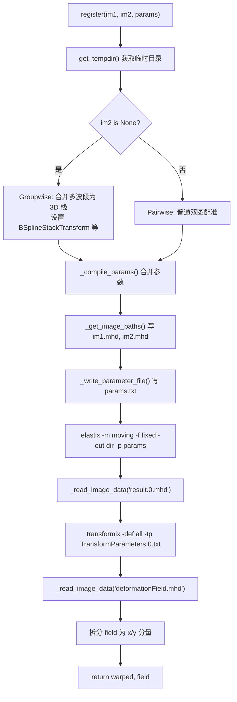

# pyelastix.py 源码解析报告

> 对应文件：`src/python/vendor/pyelastix.py`（v1.2，MIT 协议）  
> 本文档按「模块结构 → 主流程 → 函数对照 → 参数说明 → 项目用法」组织，便于逐段阅读源码。

---

## 1. 它到底是什么？

**pyelastix 不是配准算法本身**，而是一个 **Python 胶水层（wrapper）**：

```
你的 numpy 图像
      ↓  写 .mhd / .raw 文件
      ↓  写 Elastix 参数文件 params.txt
      ↓  命令行调用 elastix.exe
      ↓  命令行调用 transformix.exe
      ↓  读回 result.0.mhd、deformationField.mhd
配准后的图像 + 位移场
```

真正的 **B 样条非刚性配准、多分辨率金字塔、Mattes 互信息优化** 都在外部程序 **Elastix** 里完成。  
Python 代码负责：找 exe、临时文件、格式转换、 subprocess 调用、结果解析。

| 组件 | 位置 | 作用 |
|------|------|------|
| `pyelastix.py` | 本项目 `src/python/vendor/` | Python 接口 |
| `elastix.exe` | 需单独安装，`ELASTIX_PATH` 可指定 | 执行配准优化 |
| `transformix.exe` | 与 elastix 同目录 | 根据变换参数生成位移场 |

---

## 2. 文件结构总览（行号对照）

| 行号 | 模块 | 核心内容 |
|------|------|----------|
| 1–31 | 头部 | 版本、依赖说明 |
| 34–76 | 进程检测 | 判断 PID 是否存活（清理临时目录用） |
| 79–194 | 可执行文件 | 查找 `elastix` / `transformix` |
| 197–295 | 临时目录 & 图像路径 | 读写中间文件 |
| 298–428 | 子进程 & 进度 | 调用 exe、解析 Elastix 输出 |
| 434–587 | **`register()`** | **主入口：配准 + 取位移场** |
| 590–741 | MHD 读写 | numpy ↔ ITK MetaImage 格式 |
| 744–1050 | 参数系统 | 默认参数、合并、写 parameter 文件 |

---

## 3. 主流程：`register()` 详解

这是你最常用的函数，项目里 `register_elastix()` 最终调用的就是它。

### 3.1 函数签名

```python
warped, field = register(im1, im2, params, exact_params=False, verbose=1)
```

| 参数 | 含义 |
|------|------|
| `im1` | **Moving 图像**（要被 warp 的那张） |
| `im2` | **Fixed 图像**（参考/目标）；若为 `None` 则进入 **groupwise 模式** |
| `params` | 配准参数字典或 `Parameters` 对象 |
| `exact_params` | `False` 时会自动合并默认参数并做维度扩展 |
| `verbose` | 0=静默，1=进度，2=完整 Elastix 日志 |

| 返回值 | 含义 |
|--------|------|
| `warped` | 配准后的 moving 图像（numpy 数组） |
| `field` | 位移场，pairwise 时为 `(field_x, field_y)` 元组 |

### 3.2 流程图



### 3.3 逐步对照源码

#### Step 1：准备临时目录（471–473 行）

```python
tempdir = get_tempdir()
_clear_temp_dir()
```

每次配准在系统临时目录下使用 `pyelastix/id_<进程号>_<线程号>/`，避免多线程/多进程冲突。

#### Step 2：编译参数（480–484 行）

```python
if not exact_params:
    params = _compile_params(params, refIm)
```

`_compile_params` 会把三层参数合并（见第 6 节）：

```
固定参数(_get_fixed_params) + 高级默认(get_advanced_params) + 用户传入(params)
```

#### Step 3：Groupwise 分支（486–517 行）

当 `im2 is None` 且 `im1` 是图像列表时：

```python
# 把 [band0, band1, ..., bandN] 堆成 shape (N, H, W) 的 3D 数组
im1 = np.zeros((N,) + ims[0].shape)
for i in range(N):
    im1[i] = ims[i]
```

并**强制覆盖**一组 Elastix 参数，用于 **光谱/序列维度的全局配准**：

| 被设置的参数 | 作用 |
|-------------|------|
| `Metric = VarianceOverLastDimensionMetric` | 在「最后一维」（波段维）上最小化方差 |
| `Transform = BSplineStackTransform` | 栈式 B 样条变换 |
| `Interpolator = ReducedDimensionBSplineInterpolator` | 降维 B 样条插值 |
| `SampleLastDimensionRandomly = True` | 随机采样波段 |
| `ImagePyramidSchedule = ...` | 空间维做金字塔，波段维不做平滑（首元素为 0） |

**这对你的高光谱全局配准思路直接相关**——pyelastix 已内置 groupwise 入口，只是项目里目前主要用的是 pairwise。

#### Step 4：写图像到磁盘（519–520 行）

Elastix 只认文件，不认 numpy。`_get_image_paths` 会：

- numpy 数组 → 调用 `_write_image_data` 生成 `im1.mhd` + `im1.raw`
- 字符串路径 → 直接使用（需文件存在）

#### Step 5：调用 elastix（528–545 行）

等价于在命令行执行：

```bash
elastix -m <moving.mhd> -f <fixed.mhd> -out <tempdir> -p <params.txt>
```

输出：

- `result.0.mhd` — 配准后的 moving 图像
- `TransformParameters.0.txt` — 变换参数（B 样条控制点等）

#### Step 6：调用 transformix 求位移场（547–561 行）

```bash
transformix -def all -out <tempdir> -tp TransformParameters.0.txt
```

输出 `deformationField.mhd`：每个像素上的 \((dx, dy)\) 位移。

#### Step 7：整理返回值（563–587 行）

- 2D 图像：`field = (field[:,:,0], field[:,:,1])`，即 x、y 两个 `(H,W)` 数组
- Groupwise：返回 **多个** field 的列表
- Pairwise：只返回一个 `(fx, fy)` 元组

---

## 4. 各模块函数对照表

### 4.1 可执行文件查找（79–194 行）

| 函数 | 作用 |
|------|------|
| `_find_executables('elastix')` | 在多个目录搜索 `elastix.exe`，用 `--version` 验证 |
| `get_elastix_exes()` | 返回 `[elastix路径, transformix路径]`，结果缓存在全局 `EXES` |

**搜索顺序：**

1. 环境变量 `ELASTIX_PATH`（可指向 exe 本身或目录）
2. 当前 py 文件所在目录
3. Python 解释器目录
4. 用户主目录
5. Windows：`Program Files` 等；Linux：`/usr/bin` 等
6. 子目录名以 `elastix` 开头的文件夹（如 `elastix-5.1.0-win64`）

### 4.2 临时目录管理（197–261 行）

| 函数 | 作用 |
|------|------|
| `get_tempdir()` | 返回 ` %TEMP%/pyelastix/id_<pid>_<tid>/ ` |
| `_clear_temp_dir()` | 清空当前线程临时目录内的文件 |
| `_clear_dir()` | 删除已结束进程留下的旧目录 |
| `_is_pid_running()` | 判断进程是否还在跑，用于清理僵尸临时文件夹 |

### 4.3 图像路径处理（264–295 行）

| 函数 | 作用 |
|------|------|
| `_get_image_paths(im1, im2)` | 把 numpy / 路径统一成 `.mhd` 文件路径 |

**注意（原代码小 bug，279 行）：** 判断文件是否存在时写成了 `os.path.isfile(im1)` 而不是 `im`，对 numpy 输入无影响。

### 4.4 子进程执行（300–367 行）

| 函数 | 作用 |
|------|------|
| `_system3(cmd, verbose)` | 启动子进程，后台线程读 stdout，`verbose=1` 时显示 `resolution X, iter Y` |
| `Progress` | 解析 Elastix 输出中的分辨率和迭代次数 |

支持 `Ctrl+C` 中断并 kill 子进程。

### 4.5 MHD 格式读写（590–741 行）

Elastix 使用 ITK 的 **MetaImage** 格式：一个文本头 `.mhd` + 一个二进制体 `.raw`。

#### 写入 `_write_image_data(im, id)`（590–671 行）

```
im1.mhd  ──描述──▶  DimSize, ElementType, ElementSpacing ...
im1.raw  ──数据──▶  原始像素字节流
```

**关键细节：**

- numpy 是 **行优先 (H, W)**；写入 mhd 时 `shape` **反序**成 ITK 的 x-y-z 顺序（632 行）
- 默认 spacing = 1，origin = 0
- 支持 dtype：`float32/64`, `uint8`, `int16` 等（见 `DTYPE_NP2ITK`）

#### 读取 `_read_image_data(mhd_file)`（674–730 行）

- 从 mhd 解析 shape / dtype / spacing
- 读 raw 二进制 → `np.frombuffer`
- shape 再 **反序**回 numpy 习惯顺序（709 行）
- 包装为 `Image` 子类（可挂 `sampling`、`origin` 属性）

### 4.6 参数系统（744–1050 行）

| 函数 / 类 | 作用 |
|-----------|------|
| `Parameters` | 类似 struct，`p1 + p2` 合并参数字典 |
| `get_default_params(type='BSPLINE')` | 用户可调的核心默认参数 |
| `get_advanced_params()` | 金字塔、插值器、内部像素类型等「高级」默认 |
| `_get_fixed_params(im)` | 根据输入图像维度/ dtype 自动设定 |
| `_compile_params()` | 三层合并 + 网格间距维度扩展 |
| `_write_parameter_file()` | 写成 Elastix 认的 `(Key value)` 文本格式 |

---

## 5. 默认配准参数解读（与 Elastix 概念对照）

调用 `get_default_params()` 得到的核心参数：

| Python 属性 | Elastix 含义 | 默认值 | 说明 |
|-------------|-------------|--------|------|
| `Transform` | 变换模型 | `BSplineTransform` | **B 样条非刚性**；控制点网格定义位移 |
| `Metric` | 相似度度量 | `AdvancedMattesMutualInformation` | Mattes 互信息，适合不同对比度 |
| `NumberOfResolutions` | 金字塔层数 | `4` | **由粗到细 4 层**配准 |
| `FinalGridSpacingInPhysicalUnits` | B 样条网格间距 | `16` | 越小越精细，越易过拟合 |
| `MaximumNumberOfIterations` | 每层最大迭代 | `500` | 每层最多 500 步优化 |
| `Optimizer` | 优化器 | `AdaptiveStochasticGradientDescent` | 自适应随机梯度下降 |
| `NumberOfSpatialSamples` | MI 采样点数 | `2048` | 每次迭代随机采 2048 点算 MI |
| `FixedImagePyramid` | 固定图金字塔 | `FixedRecursiveImagePyramid` | **递归降采样**（真正的多分辨率） |

`get_advanced_params()` 额外设置：

| 属性 | 作用 |
|------|------|
| `Registration = MultiResolutionRegistration` | 启用多分辨率框架 |
| `Interpolator = BSplineInterpolator` | 优化过程中用 B 样条插值 |
| `FinalBSplineInterpolationOrder = 3` | 最终结果用 3 阶 B 样条重采样 |
| `HowToCombineTransforms = Compose` | 多级变换用复合而非相加 |

### 5.1 你在项目里常用的覆盖方式

`methods.py` 中：

```python
params = pyelastix.get_default_params()
params.MaximumNumberOfIterations = epochs      # 如 20
params.FinalGridSpacingInVoxels = spacinginvoxels  # 如 20
```

设置 `FinalGridSpacingInVoxels` 后，`_compile_params` 会**自动删除** `FinalGridSpacingInPhysicalUnits`（998–1001 行），避免两个间距参数冲突。

---

## 6. 参数合并逻辑 `_compile_params`（977–1004 行）

```
最终参数字典 =
    _get_fixed_params(图像)     # 维度、输出格式
  + get_advanced_params()       # 金字塔、插值、Resampler
  + 用户 params                 # 你设置的 epochs、grid spacing 等
```

额外处理：

1. `FinalGridSpacingInPhysicalUnits` / `FinalGridSpacingInVoxels` 若是标量，复制成 `[v, v]`（2D 各一维）
2. 若同时存在 Voxels 和 PhysicalUnits 版本，保留 Voxels

---

## 7. 两种配准模式对照

### 7.1 Pairwise（成对）— 项目当前用法

```python
warped, field = pyelastix.register(moving, fixed, params)
# field = (field_x, field_y)，各 (H, W)
```

```
Fixed (参考波段)  ◀──── MI 优化 ────  Moving (待配准波段)
                         │
                         ▼
                  BSplineTransform
                  (B样条控制点 → 位移场)
```

### 7.2 Groupwise（群组）— 高光谱全局配准潜力

```python
bands = [I_0, I_1, ..., I_{B-1}]   # 每个 (H, W)
warped_stack, fields = pyelastix.register(bands, None, params)
# warped_stack shape: (B, H, W)
# fields: 长度为 B 的 list，每个是 (fx, fy)
```

```
波段0 ─┐
波段1 ─┼─▶ 堆成 (B,H,W) 3D 体 ─▶ BSplineStackTransform
波段2 ─┤         │
 ...  ─┘         ▼
         VarianceOverLastDimensionMetric
         (让各波段对齐到「平均结构」)
```

与链式 `elastix_fun.py`（逐对、参考图递推）不同，groupwise **一次优化整个栈**，理论上可减轻误差累积。

---

## 8. 与本项目其他代码的关系

```
run_registration_exp.py
        │
        ▼
register_elastix()          ← methods.py
        │
        ▼
pyelastix.register()        ← vendor/pyelastix.py
        │
        ├── elastix.exe     ← 外部
        └── transformix.exe ← 外部
        │
        ▼
SimpleITK.Resample()        ← methods.py 再次用位移场 warp 原图
```

`register_elastix` 在 pyelastix 返回后，还用 SimpleITK 把位移场应用到 **原始 moving 图像**（保证 dtype 和值域一致）。

---

## 9. Elastix 参数文件格式示例

`_write_parameter_file` 生成的 `params.txt` 每行形如：

```
(Metric "AdvancedMattesMutualInformation")
(NumberOfResolutions 4)
(Transform "BSplineTransform")
(FinalGridSpacingInPhysicalUnits 16.0 16.0)
(MaximumNumberOfIterations 500)
```

布尔值 → `"true"` / `"false"`  
字符串 → 加双引号  
列表 → 空格分隔多个值

---

## 10. 数据流与坐标约定

| 环节 | 坐标 / 顺序约定 |
|------|----------------|
| numpy 图像 | `(H, W)` 或 `(B, H, W)`，行= y，列= x |
| MHD DimSize | 写入时 **反序**为 `W H`（ITK x-y） |
| 位移场 field | `(field_x, field_y)`，与 numpy 索引一致 |
| 位移单位 | **世界坐标单位**（默认 spacing=1 即像素） |

---

## 11. 已知限制与注意事项

| 项 | 说明 |
|----|------|
| 必须安装 Elastix | 仅复制 py 文件不够，需 exe |
| MI 随机采样 | `NewSamplesEveryIteration=True`，两次运行可能有微小数值差 |
| Groupwise 参数写死 | 487–517 行会覆盖 Metric/Transform，用户 params 中同名字段可能被改 |
| 大栈内存 | Groupwise 把 `(B,H,W)` 写临时文件，波段多时占磁盘 |
| 原 bug 279 行 | 路径模式应用 `os.path.isfile(im)` |
| 4D 图像 | `_write_image_data` 中 4D 分支为 TODO（653 行） |

---

## 12. 快速 API 速查

```python
from src.python.vendor import pyelastix

# 1. 默认 B 样条参数
params = pyelastix.get_default_params()           # BSPLINE
params = pyelastix.get_default_params('RIGID')    # 刚性
params = pyelastix.get_default_params('AFFINE')   # 仿射

# 2. 修改参数
params.MaximumNumberOfIterations = 100
params.FinalGridSpacingInVoxels = 20
params.NumberOfResolutions = 4

# 3. 成对配准
warped, (fx, fy) = pyelastix.register(moving, fixed, params, verbose=1)

# 4. 群组配准（高光谱栈）
warped_stack, field_list = pyelastix.register(band_list, None, params)

# 5. 查看合并后的完整参数字典
full = pyelastix._compile_params(params, moving)
```

---

## 13. 验证本地副本与 pip 版一致

```bash
python src/python/experiments/compare_pyelastix.py
```

该脚本对比 vendored 版与 `pip install pyelastix` 的输出差异。

---

## 14. 小结

| 问题 | 答案 |
|------|------|
| pyelastix 做配准算法吗？ | **不做**，只调 Elastix |
| B 样条在哪？ | Elastix 的 `BSplineTransform`，网格间距由 `FinalGridSpacing*` 控制 |
| 金字塔在哪？ | `NumberOfResolutions=4` + `FixedRecursiveImagePyramid` |
| 主函数？ | `register()` |
| 高光谱全局配准入口？ | `register(band_list, None, params)` groupwise 模式 |
| 本项目如何引用？ | `from src.python.vendor import pyelastix` |

若要在此基础上扩展「增量位移立方体 + 全局 loss」，可以在 `vendor/pyelastix.py` 旁新增模块，复用 MHD 读写和 exe 调用逻辑，而不必改动 Elastix 本体。
